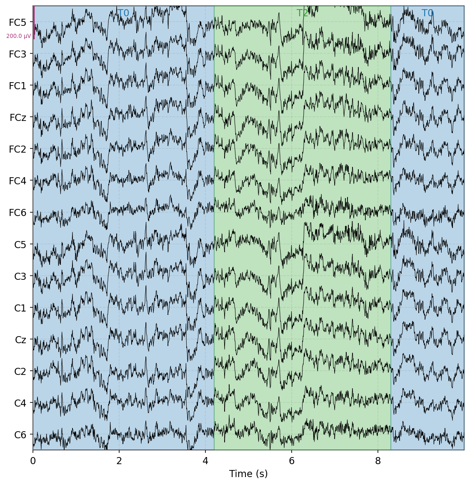
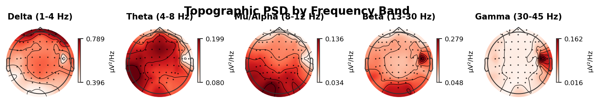
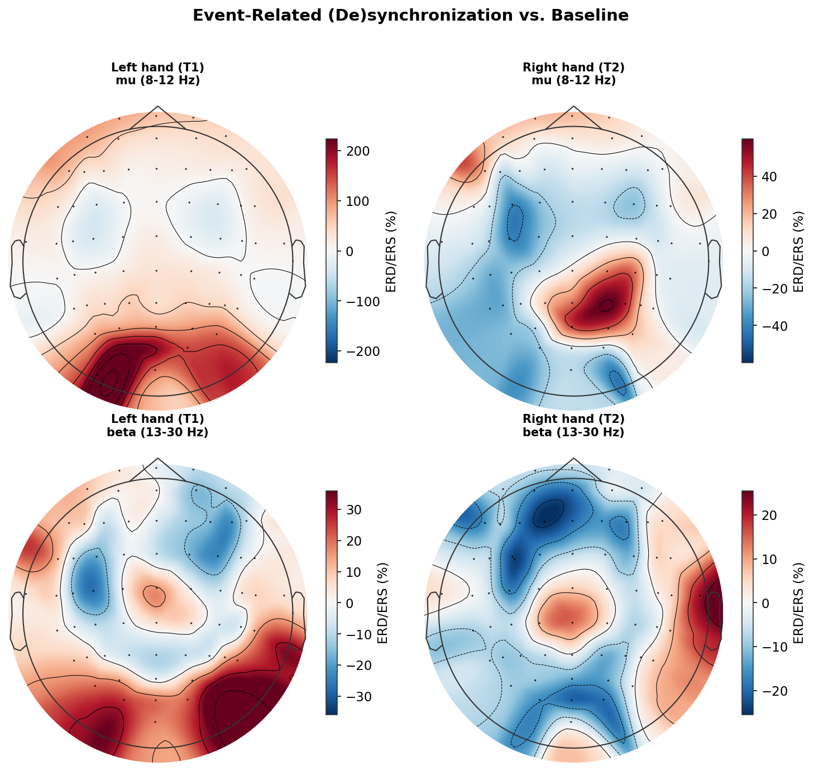
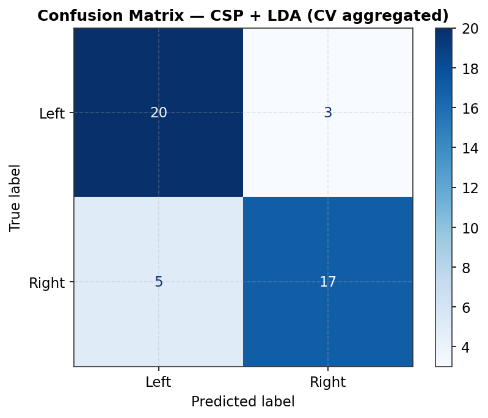
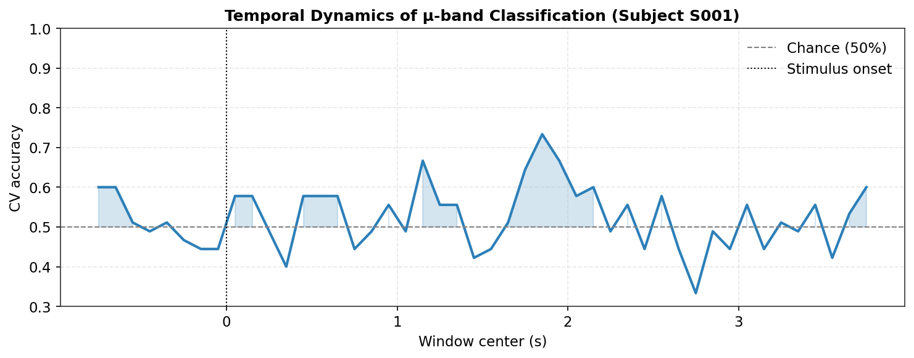

# EEG Motor Imagery Classification — Left vs. Right Hand

Decoding imagined left- vs. right-hand movement from 64-channel scalp EEG, using the [MNE](https://mne.tools/) ecosystem.

## 📌 Overview

Motor imagery — mentally rehearsing a movement without executing it — produces a measurable
drop in sensorimotor mu (8–12 Hz) and beta (13–30 Hz) rhythms over the hemisphere
contralateral to the imagined limb. This project builds a full pipeline that goes from raw
EEG to a working single-trial classifier for that signal:

1.  **Load & inspect** raw 64-channel EEG (subject 1, motor-imagery runs)
2.  **Clean** the signal — band-pass filter, robust bad-channel screening, ICA-based
   ocular-artifact removal
3.  **Epoch** around each imagined-movement cue
4.  **Visualize** event-related (de)synchronization (ERD/ERS) topographies
5.  **Classify** left vs. right imagery with Common Spatial Patterns (CSP) + LDA, both in a
   fixed window and as a time-resolved sliding-window decoder

Everything lives in a single, well-commented notebook: [`eeg_mi.ipynb`](eeg_mi.ipynb).

## 📊 Dataset

| | |
|---|---|
| Source | PhysioNet EEG Motor Movement/Imagery Dataset (EEGBCI) |
| Subject | S001 |
| Runs used | 4, 8, 12 — imagined **left fist (T1) vs. right fist (T2)** |
| Channels | 64 EEG, 10-05 montage |
| Sampling rate | 160 Hz |

## 🧪 Data & Signal Quality

A quick look at the raw signal and its spectral content confirms clean, physiologically
plausible EEG before any preprocessing — motor-band (mu/beta) power is concentrated over
central/motor channels, as expected.

   
  <b>Raw EEG</b> over central/frontal motor channels, with rest (T0) and movement-imagery (T2) periods shaded.

   
  <b>Topographic PSD</b> by band — delta through gamma — used as a sanity check before filtering/cleaning.

## ⚙️ Pipeline

- **Filtering:** 0.5–40 Hz band-pass (FIR)
- **Bad-channel screening:** robust, MAD-based modified z-score on channel standard
  deviation (a fixed µV threshold on unfiltered data was tried first and flagged almost
  every channel — see notebook for why that approach was dropped)
- **Artifact removal:** ICA (FastICA, 20 components), ocular components excluded after
  visual inspection
- **Epoching:** −1 to 4 s around each cue, no baseline correction (baseline handled
  explicitly in the ERD/ERS step)
- **Classification:** CSP (6 components, Ledoit-Wolf shrinkage) + LDA, 5-fold
  stratified cross-validation

## 📈 Results

> 💡 Figures and metrics below are from a full run of the notebook end to end. Re-running
> it (locally, since it needs to reach PhysioNet) regenerates everything in `figures/`
> with your own numbers.

**Event-related (de)synchronization.** Comparing the imagery window (1–4 s) to the
pre-cue baseline (−1–0 s) shows the expected drop in mu/beta power over sensorimotor
cortex during imagery, and a clear shift in *where* that desynchronization is strongest
between left- and right-hand trials — the core physiological signal the classifier below
is picking up on.

   
  <b>ERD/ERS (%)</b> relative to baseline, left vs. right hand imagery, mu and beta bands.

**Static-window classification.** CSP+LDA on the 1.0–2.5 s window (the heart of the
imagery period) reached **82.3%** mean 5-fold cross-validated accuracy
(chance = 50%):

   
  <b>Confusion matrix</b>, CV-aggregated predictions.

**When does the signal appear?** Sliding a 0.5 s classification window across each trial
shows accuracy rising above chance shortly after cue onset and peaking well into the
imagery period — **71.7% at t ≈ 1.75 s** in this run — which is exactly the ERD/ERS
timing physiology would predict, and a nice independent check that the static-window
result above isn't a fluke.

   
  <b>Time-resolved decoding accuracy</b> — sliding-window CSP+LDA, chance and stimulus onset marked.

## 📄 Summary

This project implements a complete EEG motor-imagery decoding pipeline using the PhysioNet EEGBCI dataset and the MNE-Python ecosystem.  
After preprocessing and artifact removal, CSP + LDA classification successfully distinguishes imagined left- vs. right-hand movement from single-trial EEG activity.  
Results show physiologically meaningful mu/beta ERD patterns and achieve up to **82% cross-validated accuracy** on the selected imagery window.
